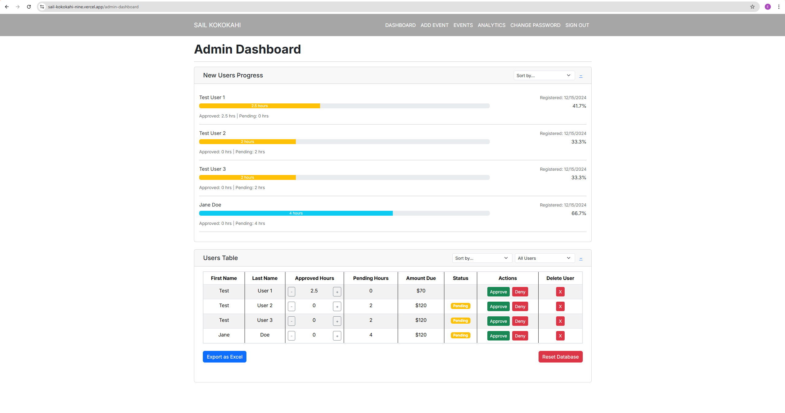
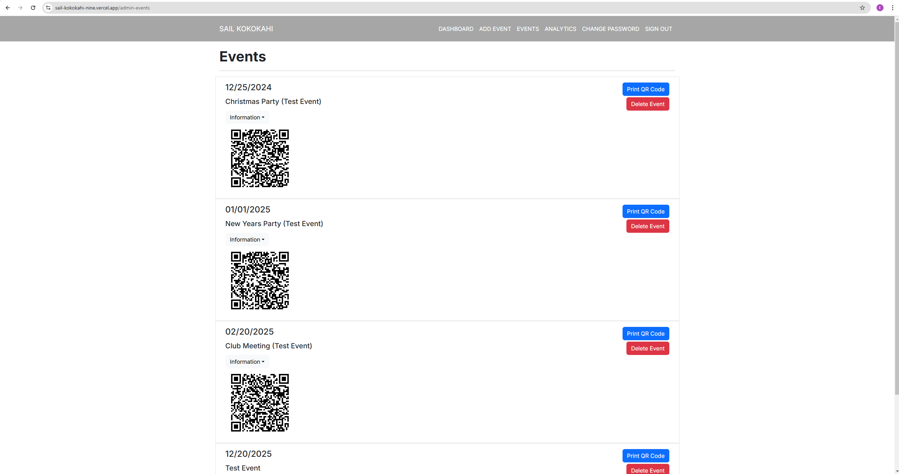
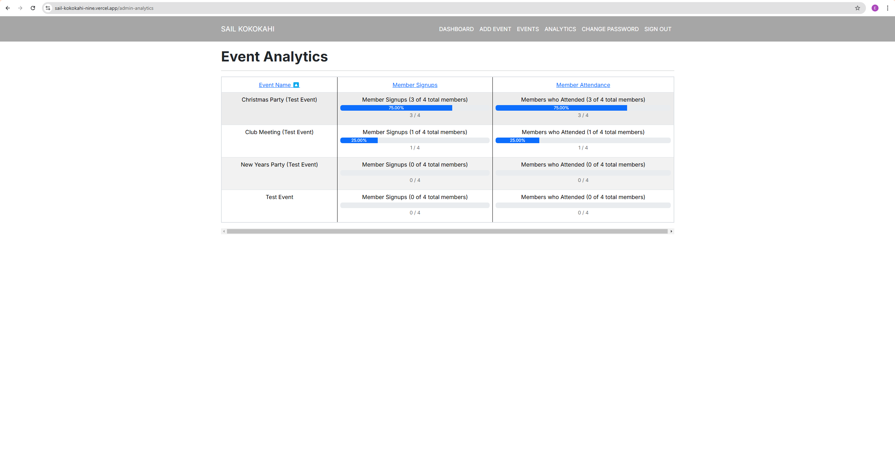

# Overview

Sail Kokokahi is a recreational sailing club established in 2022 in Kaneohe Bay, Oahu, Hawaii. The club operates on a "Work, Play, Pay" policy requiring members to contribute 6 annual volunteer hours through various activities:

Members could fulfill their hours through:
- Maintenance Projects/Club Clean-Up Days (1.5 hours per event)
- Volunteering at Club Events (1 hour per event)
- Organizing Social Activities (1 hour per event)

Members who don't meet their quota are billed $20 per unfulfilled hour. The manual tracking of these hours created inefficiencies and confusion, leading our team to develop an automated solution.

## Project Scope

As part of a Software Engineering I class project, our three-person team developed a comprehensive web application to streamline volunteer hour tracking and management. We employed agile methodologies, using GitHub for issue-driven project management and feature-based branching strategies.

# Key Features

### Admin Dashboard

### Events + QR Codes

### Analytics 

### Event Management

- Event creation and scheduling interface
- Member sign-up functionality
- Attendance tracking through QR codes
- Hour validation and approval workflow

### Administrative Tools

- Comprehensive dashboard showing member contributions
- Interactive progress bars and data visualization
- Users table with approval status and billing information
- Automated billing system integration
- Event management and participation tracking

# Execution

### Team Structure

- 3 Member collaborative team.
- My role: Primary developer for event features + analytics pages.
- Shared responsibility for maintaining code consistency
- Regular code reviews and feature testing

### Role

I served as a primary programmer for key features such as the Event Sign-Up page as well as a dynamic Event Check-In Page with QR code integration. I took on this role being it was our "secret sauce" for this project, and thus spent more time on these issues while group mates handled the rest. We maintained close collaboration to ensure consistency across the platform and mutual support for challenges.

### Development Methodology

- Agile development with regular sprints
- Feature-branch workflow in Git
- Continuous integration practices
- Regular code reviews and testing

# Conclusion

This project demonstrated the real-world impact of thoughtful software solutions on community organizations. By automating manual processes and improving transparency, we created a system that enhances the club's operations while fostering stronger community engagement.

### Resources

- [Live Website](https://sail-kokokahi-nine.vercel.app/)
- [Project Homepage](https://sail-kokokahi.github.io/)

### Additional Notes

Our implementation focused on creating a sustainable, user-friendly system that would serve the club's needs while remaining easy to maintain and update. The application's modular design allows for future enhancements and feature additions as the club's needs evolve.

The QR code check-in system, in particular, has received positive feedback from both members and administrators for its simplicity and reliability. This feature exemplifies our goal of using technology to simplify previously manual processes.

